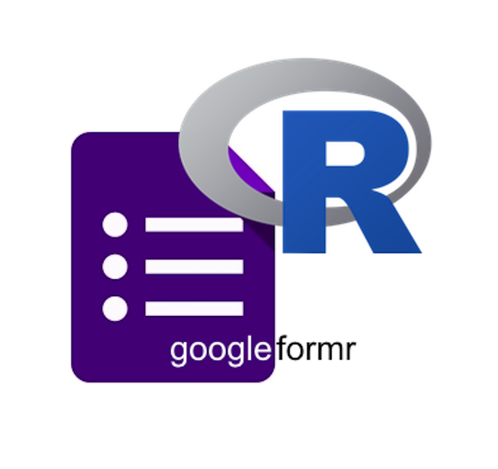

googleformr [](https://twitter.com/intent/follow?screen_name=data_steve)
============


[](http://www.repostatus.org/#active)
[](https://travis-ci.org/data-steve/googleformr)
<a href="https://img.shields.io/badge/Version-0.0.4-orange.svg"></a>


{: float="left" margin="10px" width="200px"}
**googleformr** is an API to Google Forms, allowing users to POST data securely to Google Forms without needing authentication or permissioning.


Installation
============

To download the development version of **googleformr**:

Download the [zip
ball](https://github.com/data-steve/googleformr/zipball/master) or
[tar
ball](https://github.com/data-steve/googleformr/tarball/master),
decompress and run `R CMD INSTALL` on it, or use the **pacman** package
to install the development version:

    if (!require("pacman")) install.packages("pacman")
    pacman::p_load_gh("data-steve/googleformr")


Get User Feedback with googleformr
============

**googleformr** comes with a `comments_gformr` function that was built with **googleformr**, allowing useRs to send comments to 
a Google Form I've created for collecting user feedback. 

Not every useR has a github account for posting issues, 
nor do they run their own blog, nor do they have access to nearby useR groups. 
So finding new ways to stay accessible to my useRs is important to me. 

Give it a try with something like below!

    googleformr::comments_gformr(
            post_content = "It would useful for functionality to help distinguish in the data
                            between lots of comments from one useR vs. many useRs" )


Create your own comment function
=============


You can create your own `comments_pkg_name` function by linking it to a Google Form using 
something along the lines of the code below: 


      # create function
      form <- "your_google_form_url"
      comments_pkg_name <- googleformr::gformr(form
                                               , custom_reply = "Thanks for supporting pkg_name")
      

**Note: it is recommended to call your  comments function some clearly signalling  a comment purpose but also something specific to your package.**
So a function name following the pattern `comments_pkg_name` should get the best of easy
IntelliSense auto-complete and distinguishability from other packages using the same 
functionality


Once you rebuild your package and post it to github or CRAN, your useRs
can send comments directly to you from the R console by simply 
putting their comments into your comments function.

      comments_pkg_name("useR comments")


Helper Functionality
====================

You can test that your new `comments_pkg_name` function works by:

- sending a test message to your Google Form and see if it shows up and/or
- using the `check_form_works` function like so: `check_form_works( comments_pkg_name("test") )`. Either "All good" will appear or a specific http status message describing the error.


You can also extract Google Form question text or entry points using to make sure you can bring back the same information as is on your form:

```r
# questions
form <- "your_google_form_url"
form %>% get_form() %>% get_form_questions()

# entry ids
form %>% get_form() %>% get_form_entry_ids()
```

Contact
=======

You are welcome to: 
- send me a comment via `googleformr::comments_gformr()`
- submit suggestions and bug-reports at: <https://github.com/data-steve/googleformr/issues> 
- send a pull request on: <https://github.com/data-steve/googleformr/> 
- compose a friendly e-mail to: <steven.troy.simpson@gmail.com>


